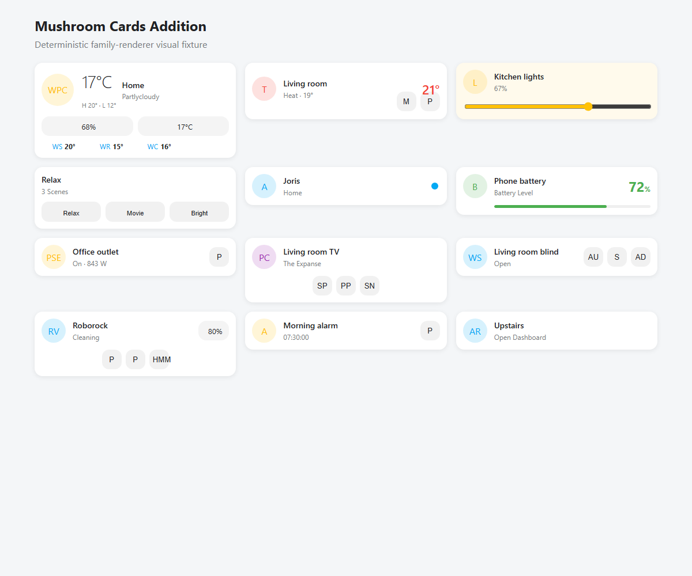

# Mushroom Cards Addition

[](https://github.com/snfx-johaver/mushroom-cards-addition/actions/workflows/ci.yml)

Mushroom Cards Addition is a HACS-installable Home Assistant frontend plugin
providing UI-configurable Lit implementations of the complete user-facing
UI-Lovelace-Minimalist card and chip catalog. The layouts, state styling,
controls, variables, and defaults are audited item-by-item while retaining a
cohesive installation alongside Mushroom.

The release contains **107 mapped upstream components** and a graphical chips
container. Every component is registered in the Lovelace
card picker, has a visual editor, and remains YAML-configurable. See the
[complete, source-linked catalog](docs/CATALOG.md), the generated
[item-by-item parity matrix](docs/PARITY_MATRIX.md), and the
[visual behavior specification](docs/VISUAL_SPEC.md).

## Requirements and compatibility

- Home Assistant 2024.4 or newer
- A modern browser supported by Home Assistant
- [Mushroom](https://github.com/piitaya/lovelace-mushroom) is recommended for a
  cohesive dashboard, but this plugin does not depend on Mushroom internals.

The plugin uses Home Assistant's public custom-card surface and native
`ha-form`, icon, entity, color, and action selectors. Compatibility guards
provide preview rendering before `hass` is available and explicit unavailable
states for missing entities.

## Install

Until the repository is accepted into HACS:

1. In HACS, open **Frontend**, choose **Custom repositories**, and add
   `https://github.com/snfx-johaver/mushroom-cards-addition` as a Dashboard
   repository.
2. Install **Mushroom Cards Addition** and restart Home Assistant if HACS asks.
3. If HACS does not add the resource automatically, add
   `/hacsfiles/mushroom-cards-addition/mushroom-cards-addition.js` as a
   JavaScript module under **Settings → Dashboards → Resources**.
4. Add a card from the Lovelace card picker and search for
   **Mushroom Addition**.

For a manual installation, copy `dist/mushroom-cards-addition.js` into
`config/www/community/mushroom-cards-addition/` and register
`/local/community/mushroom-cards-addition/mushroom-cards-addition.js` as a
module. After replacing a manually installed bundle, use
`/local/community/mushroom-cards-addition/mushroom-cards-addition.js?v=1.2.3`
(or increment the query token) and hard-refresh the Home Assistant frontend to
invalidate the browser cache.

## UI usage

Each catalog entry appears as its own card-picker item. The shared graphical
editor supports entity and multi-entity selection, name, secondary text, icon,
color, layout, documented variants, state visibility, and Home Assistant
tap/hold/double-tap actions. The **Addition Chips Card** lets users add, remove,
select, and configure chip entities without authoring Minimalist template
variables. Card-picker previews automatically select compatible entities from
the current Home Assistant instance so examples show real names and states.

The **PS5 / Xbox Card** preserves the upstream PlayStation mapping while adding
a graphical platform selector. Choose `ps5` or `xbox`; the icon and presentation
update without requiring YAML-only variables.

```yaml
type: custom:mushroom-addition-card-light
entity: light.kitchen
name: Kitchen
icon_color: amber
variant: slider
tap_action:
  action: toggle
hold_action:
  action: more-info
```

```yaml
type: custom:mushroom-addition-chips-card
chips:
  - type: custom:mushroom-addition-chip-temperature
    entity: sensor.outdoor_temperature
  - type: custom:mushroom-addition-custom-chip-update
    entity: update.home_assistant_core_update
```

## Design and behavior

Registrations share typed configuration, entity/state formatting, action
handling, responsive layout, keyboard interaction, focus treatment, ARIA
labels, unavailable and preview states, and Home Assistant theme variables.
They do **not** share one generic visual tile: weather, climate, lights, scenes,
people, batteries, energy/graphs, media, covers, vacuums, security, navigation,
and chips each use a dedicated renderer and a family-specific visual editor.
Related upstream YAML variants are exposed through relevant UI controls and
remain independently registered where that helps existing users migrate.



No upstream YAML, JavaScript bundles, or assets are copied. This is an original
Lit implementation based on documented public behavior. See
[third-party notices](THIRD_PARTY_NOTICES.md) and the per-item source links in
the [catalog](docs/CATALOG.md).
The renderer decisions and upstream source references are documented in the
[visual specification](docs/VISUAL_SPEC.md).

## Troubleshooting

- **Card not in picker:** hard-refresh the browser and verify the resource is a
  JavaScript module.
- **Entity unavailable:** select an entity that exists and is visible to the
  current Home Assistant user.
- **Editor selector missing:** update Home Assistant to a supported release;
  selector elements are supplied by the Home Assistant frontend.
- **Stale release:** clear the frontend cache or append a temporary query string
  to the resource URL after updating.

## Development

Requires Node.js 20 or newer.

```sh
npm install
npm run validate
```

`npm run validate` runs ESLint, strict TypeScript checking, catalog consistency
checks, component tests, and the production Vite build. The distributable is
`dist/mushroom-cards-addition.js`.

## Contributing

Please include tests for shared behavior or the affected component family and
update `src/catalog.ts` when upstream coverage changes. Run
`npm run docs:catalog` after catalog edits and `npm run validate` before opening
a pull request.

## License

Mushroom Cards Addition is MIT licensed. UI-Lovelace-Minimalist is also MIT
licensed and attributed in [THIRD_PARTY_NOTICES.md]. Mushroom and Home Assistant
are independent projects and trademarks of their respective owners.
